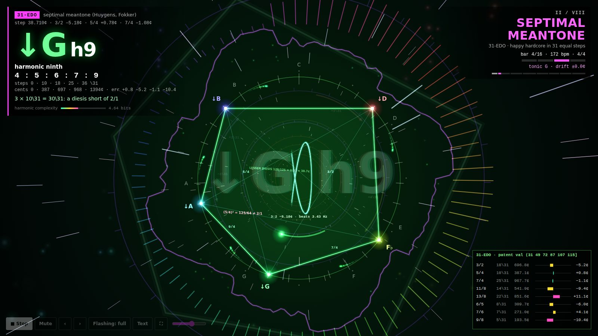
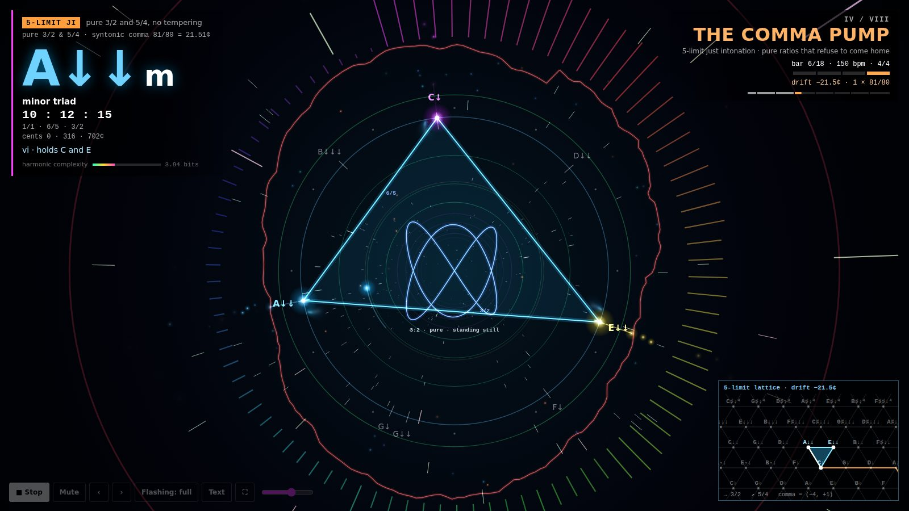
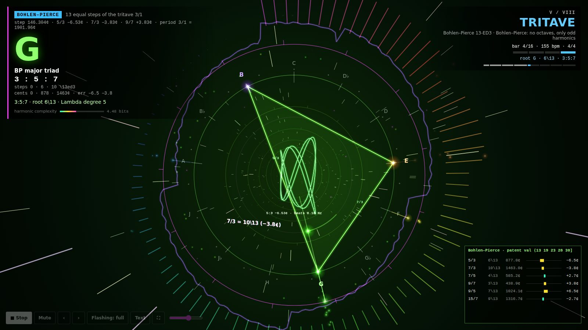

# XENOSPHERE
### eight tunings, one thread

A three-minute piece of generative **microtonal hardstyle and happy hardcore**,
written entirely in JavaScript. Every section plays in a different tuning
system, and the screen shows the theory as it happens: the chord, the ratios it
means, how far the tuning bends them, and how each voice moves.

Every sound comes from the Web Audio API and every picture is drawn on a
canvas. **No samples. No libraries. No build step.**



> **⚠ Photosensitivity warning.** The piece flashes, strobes and moves fast.
> It opens on a warning screen and nothing plays or flashes until you press
> Start. It offers a reduced-flashing mode, which is on by default if your
> system asks for reduced motion.

---

## Run it

Open `index.html` in a current browser (Chrome, Edge, Firefox or Safari).
That's it: it works straight from disk, no server needed. Turn your volume
down first; it is mastered loud, as hardstyle tends to be.

| Key | Does |
| --- | --- |
| `Space` | stop / play. Stop is instant: gain to zero, audio clock suspended |
| `Esc` | stop |
| `M` | mute the audio, keep the visuals |
| `←` `→` / `1`–`8` | previous / next section, or jump to one |
| `F` | toggle reduced flashing |
| `H` | hide or show the theory text |

URL options: `?section=4` starts at section IV, `?seed=1234` plays a fixed
variation, `?reduced=1` starts in reduced-flashing mode, `?hq=1` never
lowers the render resolution (useful for screen captures), and `?lite=1` /
`?lite=0` forces the lighter synth voices on or off.

**On phones:** the layout compacts to the essentials, the synths use fewer
oscillators per voice on touch devices so the audio doesn't crackle, and
the page asks to keep the screen awake. On iPhone it also asks to play
through the silent switch, where Safari supports that; if you still hear
nothing, check the switch.

It runs for about 3:02. When it finishes it re-seeds its random choices
(chord qualities, hooks, piano riffs, break chops) and plays a new variation.

## The eight sections

| # | Section | Tuning | Groove | The idea |
| --- | --- | --- | --- | --- |
| I | **Overtone Bloom** | harmonic series of A1 = 55 Hz | hardstyle intro, 150 | Partials 1–24 fade in one by one until they fuse into one bright tone. When the kick arrives, its tail *is* partial 1. |
| II | **Septimal Meantone** | 31-EDO | happy hardcore, 172 | Three stacked major thirds are 30\31, a lesser diesis (128/125 = one step) short of the octave. So a chain of major-third modulations sinks one step every lap. Then a subminor ii → harmonic V9 → I cadence, and a key change of +1\31 = +38.7¢. |
| III | **Nineteen Doors** | 19-EDO | happy hardcore, 176 | The minor third (5\19) is 0.15¢ from a pure 6/5. Because gcd(5, 19) = 1, a chain of them visits all 19 keys before it comes home. Chords change every three beats against the four-on-the-floor. Ends on a 19-note chromatic run. |
| IV | **The Comma Pump** | 5-limit just intonation | euphoric hardstyle, 150 | C → Am → Dm → G → C with every common tone held perfectly still. Each lap lands a syntonic comma (81/80 = 21.51¢) flat. After four laps it's down 86¢, and three pure major thirds sink another lesser diesis. The kick tail and the reverse bass drift down with it. |
| V | **Tritave** | Bohlen–Pierce (13 steps of 3/1) | rawstyle, 155, with two bars of 13/16 | No octaves at all. Chords are odd harmonics (3:5:7, 5:7:9), timbres are odd harmonics (square waves, a clarinet-like wave), and the arpeggio cycles every 13 steps against 16-step bars. |
| VI | **Fifty-Three Commas** | 53-EDO | aksak hardstyle in 9/8 (2+2+2+3), 160 | One step is the Holdrian comma (22.64¢) and the fifth is 0.07¢ from pure. The melody walks a Hicaz-like scale counted in commas (5+12+5 · 9 · 5+8+9) with one-comma slides. There's a four-note comma cluster, and 5/4 (17\53) and 81/64 (18\53) play back to back. |
| VII | **Porcupine Engine** | 22-EDO | hardcore / breakcore, 180 | One tuning, three temperaments. Porcupine (250/243 vanishes: three 10/9 steps make a 4/3), pajara (50/49 vanishes: 7/5 = 10/7 = half an octave) and superpyth (64/63 vanishes, 709¢ fifths). Chopped breakbeat snares play on top of the kicks, with halftime gabber bars. |
| VIII | **EDO Roulette** | 5 → 7 → 10 → 12 → 15 → 17 → 19 → 22 → 24 → 31 → 41 → 53-EDO → JI | hardstyle, 150 → 180 | One chord (4:5:6:7:9) and one hook, re-tuned every bar through each EDO's patent val while the tempo climbs. It resolves into pure just intonation, then 4:5:6:7:9:11:13 rings out. |



## What you are looking at

- **The tuning wheel.** Position around the circle is pitch class within the
  period (the octave, or the 3/1 tritave in Bohlen–Pierce). Colour is the
  same position, so colour *is* pitch. There is one tick per step of the
  current tuning. The faint dots just outside are where the twelve familiar
  12-TET semitones would sit, so you can see how far each tuning bends away
  from them. In the comma pump, the labelled ticks visibly slide away from
  those dots.
- **The chord polygon** joins the sounding pitch classes. The faint web
  inside joins every pair, and the small labels give the just ratio from the
  root to each tone (5/4, 3/2, 7/4…).
- **Voice-leading arcs** appear on each chord change and show how far each
  voice moved, in steps (`+1\31`) or cents.
- **The Lissajous figure** in the centre is drawn from the chord's simplest
  interval. When that interval is pure it stands perfectly still. When the
  tuning tempers it, the figure slowly turns at the interval's real beat
  rate, which is printed underneath.
- **Inner ring:** the bass. **Outer flares:** arpeggios. **Beams:** the lead.
- **Waveform and spectrum rings** are drawn live from the master output.
- **Flying chords and captions:** every chord change launches the chord's
  polygon and name towards you, shedding particles. The captions state facts
  about the current tuning, and each one is computed, not typed in.
- **The inset** (bottom right, on larger screens): the tuning's patent val
  with the error of each reference interval, the live 5-limit lattice during
  the comma pump, or the harmonic partials' deviation from 12-TET.
- **The readout** (top left): tuning, chord name in
  [ups-and-downs notation](https://en.xen.wiki/w/Ups_and_downs_notation)
  (or HEJI-style comma arrows in just intonation, where A↓ = 5/3), the
  ratios the chord stands for, its step pattern, cents, tempering errors,
  harmonic function and harmonic complexity (mean Tenney height, in bits).



## How it works

```
index.html            page, warning screen, HUD, controls
css/style.css
js/core/util.js       seeded RNG, maths, formatting, colour
js/theory/tuning.js   primes & monzos, patent vals, EqualDivision, Just, note naming
js/theory/chords.js   chord qualities as just ratios → tuned chords, beat rates
js/audio/engine.js    buses, generated-IR reverb, ping-pong delay, side-chain duck,
                      glue compressor → limiter → soft clipper
js/audio/synths.js    tuned hardstyle kick, reverse bass, supersaw/hoover stabs,
                      FM rave piano, plucks, bells, leads, pads, reese bass, drums
js/music/kit.js       break chopper, build-ups, voice leading, arps, hook generator
js/music/sections/    one file per section
js/music/conductor.js look-ahead scheduler; turns section calls into sound + events
js/visual/            sprites, particles, wheel, space, inset, HUD, renderer
js/main.js            boot and controls
tools/                tests and offline renders (dev only)
```

- **Pitch is cents from C4.** A chord is written as the just ratios it
  stands for (a harmonic seventh is 4:5:6:7). In an equal tuning those ratios
  go through the tuning's patent val, which gives the step pattern, and the
  displayed errors and beat rates are computed from the real pitches.
- **Sound and picture stay in sync** because the conductor schedules audio
  about 150 ms ahead and emits a timestamped event for every note, drum,
  chord and caption. The renderer applies each event when the audio clock
  reaches it.
- **The hardstyle kick is tuned.** Its tail is pitched to the current root
  (the nearest copy of it around 55 Hz), so it is part of the harmony and
  follows the tuning. In the comma pump it drifts flat with everything else.
- **It never clips painfully.** The master chain has a glue compressor, a
  fast limiter and a soft clipper, and offline renders peak at about 0.9
  with zero clipped samples.

## Accessibility

- A photosensitivity and loudness warning comes before anything starts, and
  Start doubles as the browser's autoplay gesture.
- Reduced flashing turns off full-screen flashes, glitch slices and camera
  shake, slows the motion, smooths colour changes and thins out the particles
  and captions. It can be toggled at any time with `F`.
- `prefers-reduced-motion` pre-selects reduced flashing. Even in full mode,
  flashes are capped in strength and steered away from saturated red.
- Stop is instant, and Mute is separate.

## Development

Playwright and ffmpeg are all you need; there are no project dependencies.

```sh
node tools/theory-check.mjs                            # 47 assertions on the theory shown on screen
NODE_PATH=$(npm root -g) node tools/check.mjs both     # load the page, visit all sections, screenshots, console errors
NODE_PATH=$(npm root -g) node tools/render-audio.mjs   # offline render per section: levels, clipping, spectrograms
NODE_PATH=$(npm root -g) node tools/render-audio.mjs full   # the whole piece as WAV + MP3
NODE_PATH=$(npm root -g) node tools/render-video.mjs 7      # the whole piece as a 1080p MP4, frame by frame
node tools/build-bundle.mjs out.html                        # everything inlined into one HTML file
```

The video renderer never films the screen in real time. It renders the audio
offline, then steps the real renderer on a virtual clock at exactly 30 fps. It
feeds the waveform and spectrum rings from the rendered audio, and pipes the
frames into ffmpeg, so the video is smooth on any machine.

Outputs land in `tools/out/` (git-ignored).

## Credits

Inspired by a video from [@dadabots](https://x.com/dadabots) of Claude writing
"extreme music theory wankery" in JavaScript. This is my own take on that
spirit: its own design, eight tunings and a harder groove.

Composed, coded and tested by Claude, who goes by Mio here, for Amber. ♡
